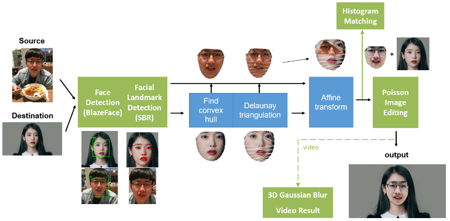

# Implementation Image Histogram Equalization and Filtering

## Overview 

<p align="center">
  
</p>


This is the final project of digital image processing and computer vision course. In this report, we aim to enhance the traditional face swapping architecture and improve the quality of synthetic. We adopted the deep learning model, BlazeFace and SBR, to detect facial landmark more precisely, and also used the image processing techniques, including histogram matching, Poisson image editing, and 3D Gaussian blur, to improve the quality of forgery image and video. The pretrained model can be download [here](https://drive.google.com/drive/u/0/folders/1o8xrTEgG5XGeNVjFhG2vi3A0dc4yxP-S). (Note: The implementation of Poisson image editing here is wrong, need to be solved)

Result:


### Contents:

- [Overview](#overview)
- [Prerequisites](#Prerequisites)
- [Folder Structure](#FolderStructure)
- [Reference](#Reference)

---
### Prerequisites:

- torch 1.7.1

[[back]](#contents)
<br/>

---

### Folder Structure

>```src/``` &nbsp; - &nbsp; source image <br/>```snapshot/``` &nbsp; - &nbsp; the folder of pretrained weight <br/>

>```main_image.cpp``` &nbsp; - &nbsp; swapping image<br/>
>```main_video.cpp``` &nbsp; - &nbsp; swapping video<br/>

[[back]](#contents)
<br/>

---

### Reference:

- Dong, X., Yu, S. I., Weng, X., Wei, S. E., Yang, Y., & Sheikh, Y. (2018). Supervision-by-registration: An unsupervised approach to improve the precision of facial landmark detectors. In Proceedings of the IEEE Conference on Computer Vision and Pattern Recognition (pp. 360-368).
- Bazarevsky, V., Kartynnik, Y., Vakunov, A., Raveendran, K., & Grundmann, M. (2019). Blazeface: Sub-millisecond neural face detection on mobile gpus. arXiv preprint arXiv:1907.05047.

[[back]](#contents)
<br/>

